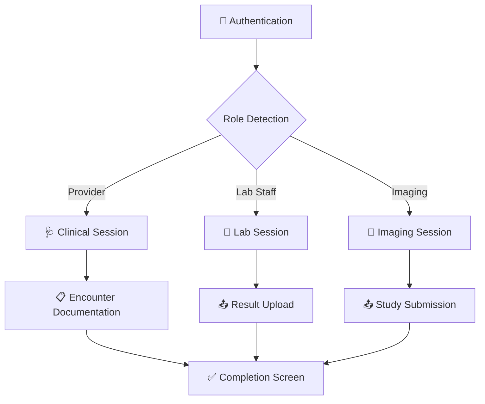

<div align="center">

<!-- Animated Banner -->


<!-- Animated Typing Effect -->
<a href="https://git.io/typing-svg">
  
</a>

<br/>

<!-- Badges -->


<br/>

<!-- Profile Views & Status -->


</div>

---

<div align="center">

## 🩺 What is Sijill Staff Portal?

</div>

> **Sijill Staff Portal** is the role-based web entry point for the **Sijill EHR ecosystem** — giving healthcare providers, laboratories, and imaging centers a controlled, elegant workspace for patient-facing clinical workflows. One portal. Every role. Zero confusion.

<div align="center">

```
🏥 Provider  ──►  Clinical Sessions & Encounter Documentation
🧪 Lab Staff  ──►  Token Redemption & Result Upload
🩻 Imaging   ──►  Radiology Orders & Diagnostic Submissions
```

</div>

---

## 📋 Table of Contents

<div align="center">

| | Section |
|:---:|:---|
| 🌟 | [Overview](#-overview) |
| ⚙️ | [Core Workflows](#%EF%B8%8F-core-workflows) |
| 🏗 | [Architecture](#-architecture) |
| 🔐 | [Security Model](#-security-model) |
| 🎨 | [UI & Motion](#-ui--motion) |
| 🧪 | [Technologies](#-technologies) |
| 🚀 | [Run with Docker](#-run-with-docker) |
| 🌱 | [Future Vision](#-future-vision) |

</div>

---

## 🌟 Overview


Sijill Staff Portal keeps healthcare workflows **structured**, **role-aware**, and **accessible** from a single web application. Instead of forcing staff to work across disconnected systems, the portal gives each user a dedicated route into the part of the platform they're responsible for.

- 🩺 **Providers** review patient identity, history, and document encounters
- 🧪 **Labs** redeem patient tokens, inspect orders, and upload results
- 🩻 **Imaging centers** follow the same token-based flow for diagnostic studies
- 🔒 **Role isolation** keeps each user locked into their correct workflow

The frontend is built with **React + Vite**, navigated by **React Router**, powered by **Axios** for APIs, and driven by **Framer Motion** for a premium animated UI experience.

<br clear="right"/>

---

## ⚙️ Core Workflows

<div align="center">



</div>

| Workflow | Description |
|:---:|:---|
| 🩺 **Provider Sessions** | Access patient identity, medical history, and encounter documentation through a structured clinical flow |
| 🧪 **Laboratory Sessions** | Redeem a patient token, inspect lab orders, and submit results through a dedicated workflow |
| 🩻 **Imaging Sessions** | Token-based flow for radiology and diagnostic study submissions |
| 🔑 **Auth & Recovery** | Login, registration, OTP verification, and password reset — all in dedicated portal pages |
| 🛡️ **Protected Routing** | Session-aware route guards keep users inside the correct role and workflow |
| ✅ **Result Confirmation** | Completion screens provide a clear, definitive end state after submissions |
| 📄 **PDF Generation** | Utilities for generating encounter summary PDFs from recorded clinical data |

---

## 🏗 Architecture


The application is organized as a **single-page React frontend** with separate route groups for public pages, authentication, provider workflows, and diagnostic portals.

- `ProtectedRoute` enforces access by authenticated role and session type
- A centralized **Axios client** attaches bearer tokens and normalizes errors
- Clinical and portal sessions are stored **client-side** to preserve context across navigation

### 📁 Project Structure

```text
sijill-staff-portal/
├── 📦 src/
│   ├── 🔌 api/          # Auth, clinical, lab & imaging API clients
│   ├── 🧩 Components/   # Shared UI & workflow-specific components
│   ├── 📄 Pages/        # Route-level screens: landing, auth, provider & portal flows
│   ├── ⚙️ constants/    # Portal/session config & medical lookup data
│   ├── 🌐 context/      # Shared app state (toast notifications, etc.)
│   └── 🛠️ utils/        # Session helpers, routing helpers & PDF utilities
├── 🌍 public/
├── 🐳 Dockerfile
├── 🐳 docker-compose.yml
├── ⚡ vite.config.js
└── 📘 README.md
```

<br clear="right"/>

---

## 🔐 Security Model

<div align="center">

| 🔒 Layer | Implementation |
|:---:|:---|
| **Authentication** | Password-based login with OTP verification |
| **Authorization** | Route access is strictly restricted by user role |
| **Session Scoping** | Clinical and portal workflows require a valid session before rendering |
| **Token Usage** | Backend requests attach bearer tokens where required |
| **Boundary Enforcement** | Provider, Lab, and Imaging flows are fully isolated from one another |

</div>

> 🛡️ **Zero-trust boundary**: no user can enter a workflow they are not authorized for — the portal enforces this at both the routing and API layers.

---

## 🎨 UI & Motion


The interface is **not a static form shell**. Every interaction is designed to feel responsive and deliberate.

- ✨ **Background particles & gradient layers** add depth to the landing page
- 🌊 **Section transitions** use fade and scale-in patterns via Framer Motion
- 🔔 **Toast notifications** with smooth motion-driven feedback states
- 🎯 **Iconography** from Bootstrap Icons and Lucide for at-a-glance readability
- 📱 **Responsive layouts** adapting gracefully across devices

<br clear="right"/>

---

## 🧪 Technologies

<div align="center">

| Category | Stack | Badge |
|:---:|:---|:---:|
| ⚛️ **Frontend** | React 19, Vite 6 |   |
| 🧭 **Routing** | React Router |  |
| 🔌 **API** | Axios |  |
| 📝 **Forms** | React Hook Form, Zod |  |
| 🎨 **UI** | MUI, Bootstrap, React Bootstrap |   |
| 🎬 **Motion** | Framer Motion |  |
| 🔷 **Icons** | Bootstrap Icons, Lucide, React Icons |  |
| 📄 **PDF** | jsPDF |  |
| 🐳 **Deployment** | Docker, Nginx |   |

</div>

---

## 🚀 Run with Docker


### ▶️ Build and Run

```bash
docker compose up --build
```

The app will be available at 👉 **`http://localhost:8080`**

### 🔧 Configure the API Base URL

**Windows (PowerShell)**:
```powershell
$env:VITE_API_BASE_URL="https://your-api.example.com/api/v1"
docker compose up --build
```

**Linux / macOS (Bash)**:
```bash
VITE_API_BASE_URL="https://your-api.example.com/api/v1" docker compose up --build
```

### 🏗️ Build the Image Directly

```bash
docker build -t sijill-staff-portal \
  --build-arg VITE_API_BASE_URL=https://your-api.example.com/api/v1 .

docker run -p 8080:80 sijill-staff-portal
```

<br clear="right"/>

---

## 🌱 Future Vision

<div align="center">

```
🗺️ Roadmap
```

</div>

| 🚩 Priority | Enhancement |
|:---:|:---|
| 🔥 **High** | Offline support with service workers for low-connectivity environments |
| 🔥 **High** | Real-time notifications for critical lab and imaging result updates |
| 🌟 **Medium** | Interactive dashboard for workflow analytics and session metrics |
| 🌟 **Medium** | Multilingual support (Arabic, English, French) |
| 💡 **Future** | Mobile app companion via React Native |
| 💡 **Future** | AI-assisted encounter documentation |

> The long-term direction for Sijill Staff Portal is to tighten the connection between healthcare workflows and the data they depend on — serving as the operational front door for **secure, coordinated care**.

---

<div align="center">


## 📜 License

This project is licensed under the **MIT License**.

---


**Built with ❤️ by the Sijill Engineering Team**

*Last Updated: 1 July 2026*

</div>
